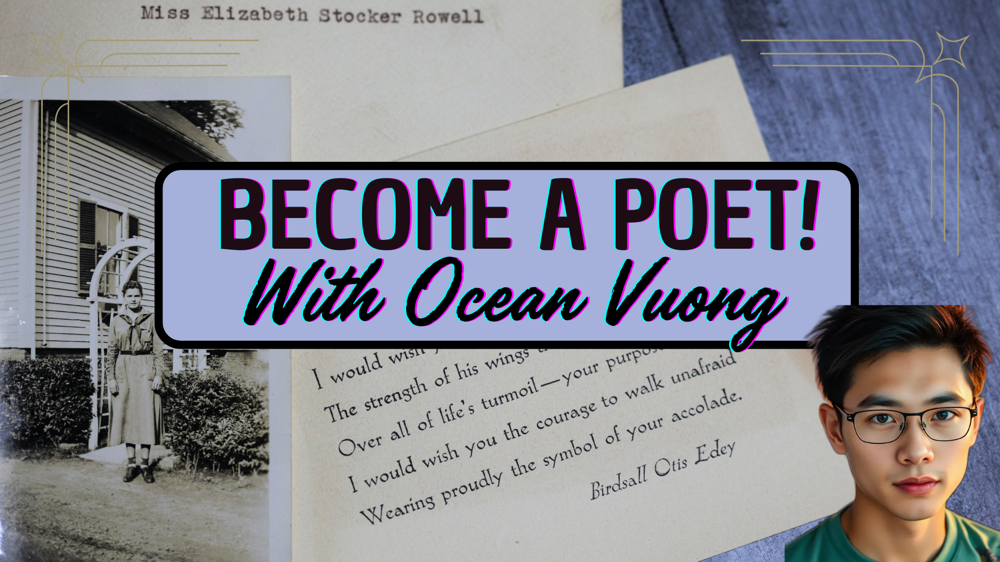

# Become-a-poet---Ocean-Voung

## Overview

**"Become a Poet: Ocean Vuong"** is an educational and immersive game that takes players through the life and creative journey of Ocean Vuong, a celebrated poet and writer. The game explores Vuong’s experiences as a Vietnamese-American immigrant, his reflections on family, love, trauma, and his rise as a literary icon. Through interactive storytelling, the game aims to foster empathy, self-reflection, and an appreciation of Vuong’s poetic vision.

## Internship Project

This game is developed as part of an internship project, with the goal of creating an impactful and poetic narrative using **Rosebud AI** and the **Phaser** game framework. The project merges technical development with creative writing to produce a meaningful educational tool that offers insight into Vuong’s life and work.

## Features

- **Educational Content**: Explore the life and writings of Ocean Vuong, focusing on themes of identity, memory, and the immigrant experience.
- **Interactive Scenes**: Navigate through significant moments in Vuong's life, including his childhood, family, and literary achievements.
- **Cultural and Emotional Design**: Experience a reflective atmosphere with soothing colors and minimalist designs inspired by Vuong’s work and Vietnamese-American culture.
- **Story-Driven Gameplay**: Unlock different parts of Ocean Vuong’s life and his poetry as you progress, learning how personal experiences shape his art.

## Technology Stack

- **Rosebud AI**: Used for generating artistic assets and enriching the creative process.
- **Phaser**: A robust framework for developing 2D games, used to design and run the game.

## Live Link:

[https://your-website-link.com](https://your-website-link.com)

## Live on RosebudAI

[https://play.rosebud.ai/games/97d397da-937f-47f3-bd40-27a845e42f2e](https://play.rosebud.ai/games/97d397da-937f-47f3-bd40-27a845e42f2e)

## Usage

The following images show the game’s appearance and functionality:

## License

This project is licensed under the MIT License. See the [LICENSE](LICENSE) file for more details.

## Acknowledgements

- Special thanks to the **Rosebud AI** team for their support and resources.
- Inspired by the life and poetic legacy of **Ocean Vuong**, whose work continues to touch lives worldwide.
